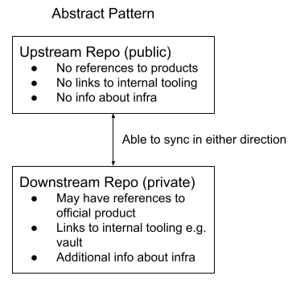

# ADR-00002 Open Source Documentation

Authors: Rachel Lawton, David Martin

## Status

Draft.

## Problem Statement

We want to build an upstream community around managed services. This means all aspects of the managed service including the ability to run and manage the service, which extends to operational knowledge & procedures. One such element is Standard Operating Procedures (SOPs). These SOPs include information like how to scale up the service as load increases as well as how to diagnose and fix specific issues based on alerting. However, currently these SOPs have been written from an internal perspective and are not immediately usable or consumable upstream.
This document proposes a solution for maintaining an upstream version of the SOPs and having a mechanism for consuming them downstream, as well as vice versa.

## Goals

* Propose a model for maintaining 2 versions of documents, for upstream and downstream consumption
* Provide a worked example of this model as a reference

## Non-goals

* Implement a complete solution for a product or service

## Current Architectures

A Standard Operating Procedure (SOP) is a document used by SREs in response to alerts and other events.
An example of what a current SOP architecture looks like is the Red Hat OpenShift Streams for Apache Kafka (RHOSAK) managed service. The RHOSAK SOPs are located in a private repository, as the SOPs contain references to Red Hat specific internal information that is not suitable for consumption by external users. Such information includes links to Vault secrets, information about how RHOSAK specifically set up their stage and production environments and information on the infrastructure itself, for example what certain custom resources should look like. The flow of how information is contributed to the RHOSAK SOPs is for an engineer or SRE to submit PRs to the repo.

## Proposed Architecture

The proposed solution is to follow a two repository model. One private repository that will contain SOPs that have the Red Hat internal information mentioned above, the other being a public repository that will have SOPs with the Red Hat internal information removed. This model will allow the SRE teams to use the private SOP repository without any information loss and allow upstream users to use and contribute to the SOP without breaching any Red Hat data policies.

The content of the SOPs will be mirrored/synced between both repositories apart from the Red Hat internal information. The flow of contributing information to the repositories can be done both ways i.e. from downstream to upstream and from upstream to downstream. This information can be contributed manually through the creation of pull requests or it can be done autonomously using the mirroring features in the repository. The team in charge of the SOPs will be responsible for maintaining the information between both repositories. This includes merging contributions from external users in the upstream repository and ensuring, if applicable, it gets added to the downstream repository and vice versa.

SOPs from a private downstream repository that contain sensitive information, will have to be cleaned of all sensitive information before being pushed to the upstream public repository. Such information might be links to vault secrets or information about the managed service infrastructure etc. The pre-existing Structure of  the SOPs should also be looked at, to see if any information can be removed that is no longer necessary or can be moved to a different internal location, this will help reduce overhead when syncing.

## Challenges

* Existing managed services may have pre existing documentation in a private repo that want to adopt this model. They will have to migrate their current docs to the upstream public repository. These docs may have content already that would need to be stripped back or cleaned for the upstream repo.
* The overhead of having to maintain two separate repos, ensuring that neither become out of sync or become unusable and out of date.
* Ongoing due diligence to avoid publishing information that would be helpful to an attacker compromising the service.

## Alternatives Considered

* Not having open source documentation for managed services. Rejected initially as this is core to the Red Hat ethos. However, there has to be sufficient value in what's published upstream. For example, if the public content omits so much to the point of being useless, there may be bigger problems to solve if we want to build a community around running a managed service.

## Dependencies

* n/a

## Stakeholders

* SRE
* Engineering

## Consequences if Not Completed

* No open source solution for documentation in various managed service communities.
