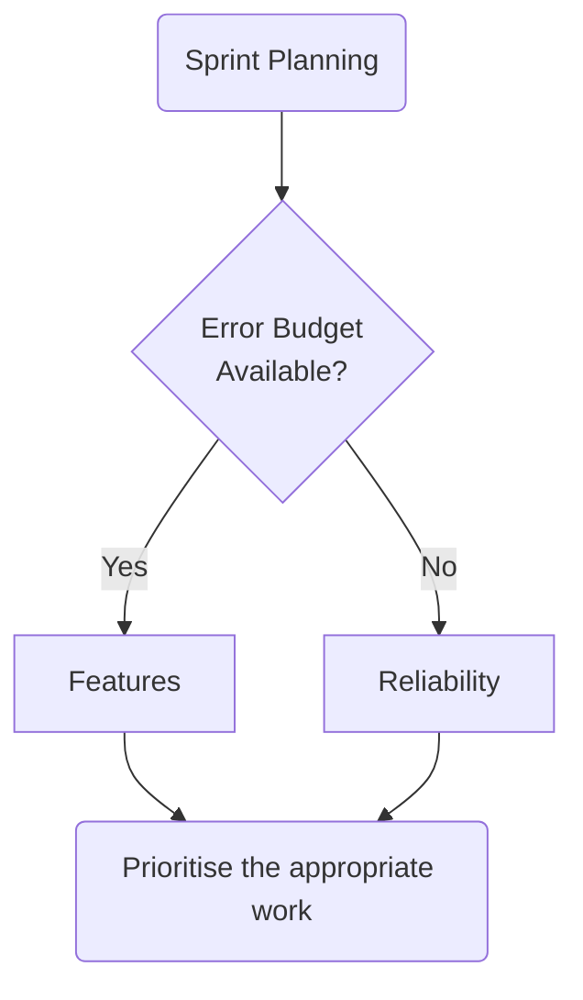
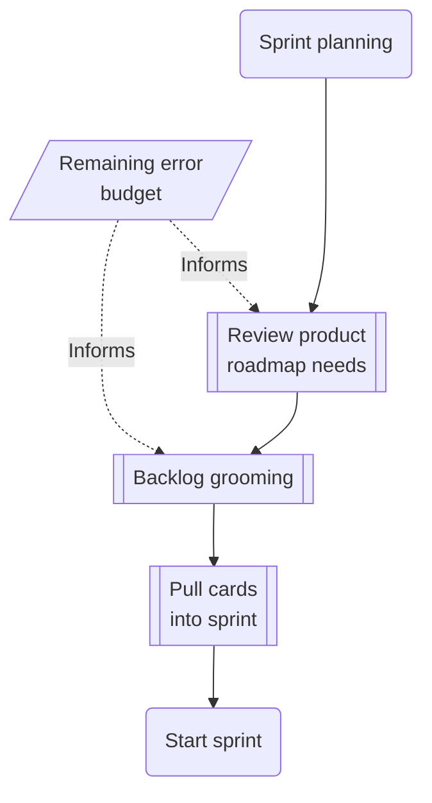

# ADR-00005 SLO Lifecycle

Authors: Lisa Seelye <@lisa>, Jeremy Eder

## Status

Draft

## Problem Statement

A primary goal of Service Level Objectives is to inform the natural cycle of work for product feature teams by adding an additional signal for use in planning work.

There are a number of complex processes and [personas][personas-adr] that play different roles in the successful implementation of an SLO. One hurdle some teams encounter with creating SLOs for their services is the absence of a guide to show the steps for getting started.

Quantifying the user experience is difficult because user experience can so often be subjective, and therefor hard to measure. Service level objectives seek to provide an objective way to measure the customer experience; the goal of the SLO is to provide a consistently high customer experience. The assumption is that when a service is reliable enough, then its customers will be happy.

This document aims to provide a base on top of which teams can build a successful SLO implementation.

## Goals

* The guide is generic enough to be used by any service as-is.
* The guide doesn't prevent anyone from taking it and tweaking it to their needs.

## Current Architecture

* Various ad-hoc practices, where they already exist.

## Proposed Architecture

Add Service Level Objectives (SLOs) with their own distinct lifecycle described herein. The PM will be accountable for the SLO feature.

Break down the SLO lifecycle into three phases:

1. [Research](#research-phase) (where SLO ideation and gap analysis takes place)
1. [Implementation](#implementation-phase) (where one Implements any required technical and process changes)
1. [Iteration](#iteration-phase) (where one begins living with the SLO and where one may decide on improvements or changes to the SLO based on real world experience)

### Research Phase

The Research Phase consists of two lines of work which result in a SLO proposal agreement between stakeholders.

Initially, Product Managers, Engineering Managers and SRE representatives will gather business and technical requirements that will inform the subsequent SLO discussions. The types of requirements may include what customer (both internal and external) expectations are for the service in terms of its performance, reliability and durability where applicable. Once the requirements are gathered, product managers and/or engineering leads for the service create a plan to implement the changes. The plan should contain enough details to successfully implement any required changes to the service. The changes might include [instrumenting SLIs][sli-guide], the creation of a monitoring dashboard, team policy and procedure changes and so on. The [RACI chart][raci-chart]] can be used as a guide for the Implementation Phase when the work is assigned.

### Implementation Phase

With an accepted proposal from the Research Phase, an owner can be found to implement the changes. Not all of these changes are necessarily made by software engineers. Certainly changes to instrument the service’s codebase is in the domain of the software engineer, but changing team policies and practices is more likely to be the domain of the engineering lead. Remember that the work isn’t intended to be wholly owned by the person to whom it is assigned, that person can and should work in concert with people who can assist. [Consider the RACI chart][raci-chart] which shows that more than just one role is involved; work as a team to accomplish the goals.

The owner will likely be an engineer on the service's team who may work in concert with an appropriate SRE to affect changes to the service and related ecosystem.

By way of example, some of these changes may include (but not limited to):

* SLI (Service Level Indicator) instrumentation in the service
  * Software changes
* SLO Dashboard Changes
  * Creation of SLO Dashboard
  * Changes to existing SLO dashboard to incorporate new changes
* Changes to team policies and practices to support the [Iteration Phase](#iteration-phase)

### Iteration Phase

Once the SLOs are adopted, the [service stakeholders][raci-chart] will enter the lifecycle loop where the team and service come to live with the SLO. Now the team uses the previous work to instrument and monitor the service. Sprint planning is influenced by the error budget. Existing SLOs are continually evaluated for needed changes, or even their retirement. Changes will want to kick off a new Research Phase to propose and understand the scope of changes.

#### SLO Review

Part of healthy SLO adoption is the periodic review of the service's SLO needs. These review tasks may include:

* Do the service's SLOs still measure the right thing(s) to measure customer happiness and service reliability?
  * Do we have direct customer feedback or telemetry from which we can infer customer feedback?
* Are the SLOs' SLIs still appropriate? Are there newer, better (ex. less computationally expensive) indicators that should be used?
* Is a SLO still needed? (ex. Does the service landscape or user experience still demand it? Has another SLO superseded it?)

These steps can be used to evaluate the SLOs themselves, but there's also review on the targets set by the service's SLO(s):

* Are the service's SLOs being met?
  * If they're not, what are common reasons why not? Identify who is best suited to remediate.
* What are the common reason(s) for risks and observed hits to the error budget?
  * How can they be mitigated in the future?
* What is the error budget burn rate? Will corrective action be needed at the current rate?

Remember that some of these review steps can be outwardly facing to include external stakeholders such as service consumers within the organization.

##### Remediating SLOs

Sometimes an SLO may fail to be met. In these cases it's important to perform an investigation to determine what's causing the failure. Software can be infinitely complex and that means it isn't possible to list every possible cause, so what follows is a necessarily incomplete set of examples:

* Sometimes the cause might be a result of an upstream quality or reliability issue that needs to be escalated to the team or vendor responsible.
* Sometimes it may be a result of a defect that was deployed.
* Sometimes it may be a result of insufficient capacity to meet the needs of the userbase that can be resolved by a capacity planning cycle.

Whatever the cause, the [RACI chart][raci-chart] can help inform who the responsible parties are for remediation.

#### Sprint Planning Hooks

A primary goal of Service Level Objectives is to inform the natural cycle of work for product feature teams by adding an additional signal for use in planning work. The new signal is the service's remaining Error Budget.

The "elevator pitch" flow chart looks like this: If there's error budget remaining, it's a green light to focus on features, otherwise, focus on reliability.

In reality, however, the error budget is not meant to be the _only_ signal feeding sprint planning; it is merely _another_ signal that can be used to prioritise work. Planning is still up to the team and can focus on features when it makes sense. Sprint planning may look like this with the error budget informing decisions.

A parting thought for this section is to remember the purpose of the Service Level Objective and associated error budget is to model customer satisfaction. Use caution when deprioritizing reliability for features when the error budget is depleted, or projected to become exhausted. Those who are closest to the service will have the best understanding of any impact for delaying reliability enhancements.

## Challenges

* Teams may desire to adopt the guidelines in this document but lack the data to do so because they don't have any SLO, or a way to measure the remaining error budget. 
* Teams may face encounter difficulties scheduling "reliability work" by those who deprioritize it in favour of "feature work."
  * Related, teams may not have the throughput to address "reliability work" above "keeping the lights on" work. (See also toil management.)

These challenges could be addressed by a [permissive SLO phase](#permissive-slo-phase).

### Permissive SLO Phase

Teams may find that adopting this SLO lifecycle challenging for any number of reasons, whether they're listed in the [challenges](#challenges) section or not. For teams that want adopt a lightweight approach to the SLO lifecycle, a "permissive phase" could be helpful.

Borrowing this terminology from the [SELinux Project][selinux-project] the team engages in the practice of SLOs, but without any "enforcing" aspect to the lifecycle. This period of permissiveness gives the team a chance to walk alongside the SLO lifecycle without necessarily being lead by the SLO lifecycle.

Like with SELinux, the most value from the system comes from the "enforcing mode" and the transition from a permissive SLO phase to an "enforcing" phase is where the most value is found. Be sure to include a transition plan during the [Research Phase](#research-phase).

## Dependencies

* The existence of an SLO.
* Reporting for SLO compliance and error budget exhaustion.
* Willingness to prioritize "reliability work" over "feature work" when necessary to ensure a continued customer experience.

## Stakeholders

* Key stakeholders are available in the [RACI chart][raci-chart].
* [Personas described in ADR-00002][personas-adr]

## Consequences if Not Completed

Key consequences for not adopting a SLO lifecycle is that there will continue to be ad-hoc practices if they exist. Teams may not set themselves up for success without adopting a lifecycle for SLOs.

[sli-guide]: https://github.com/operate-first/sre/pulls/8
[raci-chart]: https://github.com/operate-first/sre/pulls/9
[personas-adr]: https://github.com/operate-first/sre/blob/main/ADRs/RH/SIG-SRE/ADR-00002%20Personas%20related%20to%20Managed%20Services.md
[selinux-project]: https://selinuxproject.org
