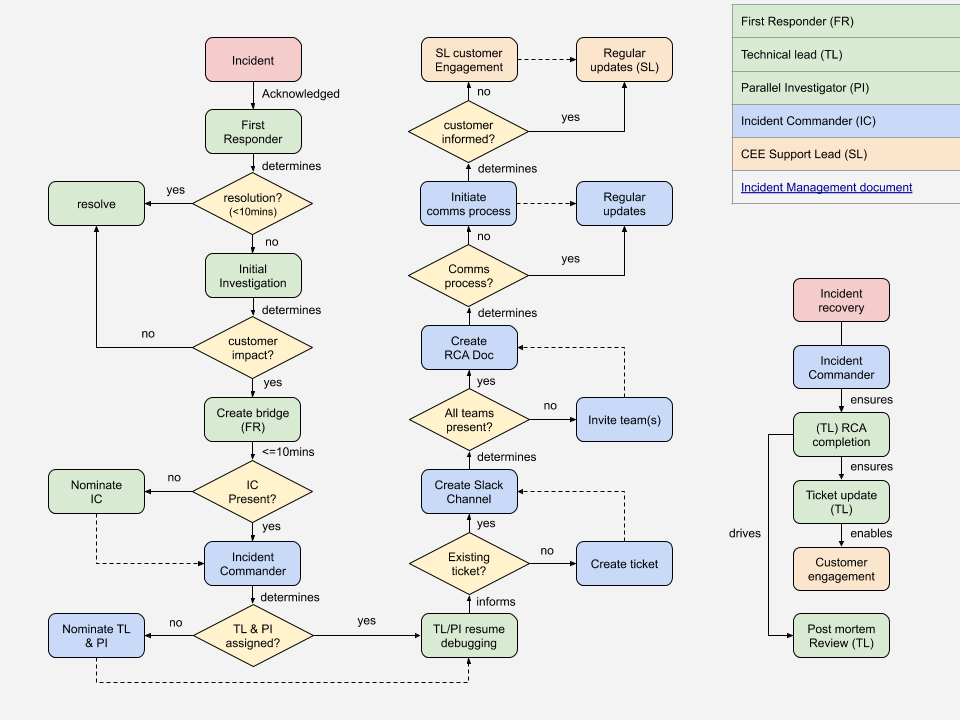

# Incident Management Process

## Introduction
The goal of this page is to document the incident management process.

It aims at formalizing the roles of the different actors while working on a **major** incident, as well as describing the high level course of actions and mandatory steps that need to be taken to minimize MTTR (=Mean Time To Recover/Repair, so ensuring quick recovery of our services) and proper customer communication and satisfaction throughout the process.

There can be multiple levels of severity for an incident depending on the impact it has. The process below would be used when the incident is considered to be a major incident. When the incident is a minor one then a lightweight ad-hoc process can be used. The goal being to make sure not to make the process too heavy for small incidents.

A major outage can be defined when our platform is running out of error budget or when we start failing our SLOs:

examples of major incidents:
* Full outage or heavy degradation of one or multiple services impacting one or several customers
* Duration of the incident is greater than 4 hours
* Multiple layers and SRE teams are impacted (platform, application, …)

Note that when a team has a path for fast recovery then they shouldn't break it to fit that process if it's not required.

## Quick reference guide
In case of customer impacting incident (persisting or intermittent degradation of customer exposed functionality)

1. The Incident First Responder is the first SRE being alerted of the issue and starting the investigation
2. After initial investigation the First Responder involves the Incident Commander (by default a Region Lead but could be Team Lead or Manager) to help with the coordination of the recovery efforts
  1. First Responder opens the bridge call for that
3. The Incident Commander manages the communication and coordination around the recovery
  1. By creating a dedicated IM channel to record the audit trail of the incident resolution.
  2. Post a notification in the relevant channels for external awareness.
  3. By involving the right people to help and speed up the recovery process
  4. By ensuring a good communication with first level support and the customer
4. The incident is recovered
5. The Incident Owner (usually the First Responder unless the Incident Commander picked someone else) is responsible for running and documenting the post mortem and root cause analysis and bring the incident to full closure.

## Incidents
An incident is an event that can occur at any time and which results in a degradation or outage of one or multiple of our services.

An incident can be raised by a customer or directly by our monitoring and alerting systems, or directly by a member of the SRE team.

Depending on the impact of the incident on the services and customers it will be categorized in terms of severity.

As an SRE organization we should aim at:

* Minimizing the time it takes us to recover the service (MTTR)
* Improve Reliability of our services: i.e. having as few incidents as possible, optimizing prevention of incidents
* Having incidents with the least impact to our customers
* Catching incident occurrences through our automation (monitoring/alerting) before they are noticed by the customer
* Avoiding re-occurrences of similar incidents
* Minimizing the time to detect a potential incident (MTTA)

## Roles and Responsibilities

### Incident First Responder
Any SRE investigating a cluster issue becomes this, when they notice a **problem with a cluster or a specific application**  which:
* may be a **customer–facing cluster having an issue impacting (degradation or outage)**
* or cause **imminent major outage.**

A major outage can be defined when our platform is running out of error budget and we start failing our SLOs.

SRE teams have the concept of an on-duty shift person who is responsible for answering to alerts and incidents while the rest of the team is focusing on engineering work. These persons will usually be First Responders. Most often a shift Primary or Secondary become First Responders while investigating ongoing cases/alerts.

#### Initial Response
Before doing any further troubleshooting, First Responder must, in order:

1. **Create a bridge.**
2. Using IM, **post a message in the relevant channels** with:
  * link to bridge,
  * short description of issue (which cluster, what’s failing),
  * your IM handle.
Only now can you continue debugging while describing the problem to people joining the bridge.

#### 10 Minutes Later
**If** 10 minutes after your announcement your **region lead or manager haven’t joined** the bridge and you haven't managed to recover the service:
* halt any further technical work
* **pick an Incident Commander** from among the SREs present.

Only now can you continue debugging.

#### Comments / Reasoning
* **The First Responder Protocol is the most important part.**
* It needs to be:
  * **as short as possible** – since everybody needs to know it by heart,
  * **as simple and unambiguous as possible** – because it needs to guarantee proper bootstrapping of the full Incident Management Process even by someone who’s still in training and accidentally stumbled upon a serious issue.

### Incident Owner
* The Incident Owner is by default the First Responder
* The Incident Owner role is not handed over from one shift to the next and stays the same throughout the lifecycle of the incident unless the current owner doesn't feel confident or can't assume the role throughout the incident. In that case the role can be handed over and the handover needs to be fully documented and communicated to the wider team.
* The incident ticket is assigned to the Incident Owner

#### Responsibilities
The main responsibility of the Incident Owner is to assume the complete ownership of the incident from a technical standpoint:

* Understanding the course of the incident and its technical details from start to finish
* Organizing and driving the PMR meeting in the 5 business days after recovery
* Is accountable to ensure that full RCA documentation is written up and making sure it contains all the information with regards to primary and secondary corrective actions
* Being the main point of reference for the incident when there are follow-up questions about it
* Driving any follow-up activity linked to the incident owned
* Cleaning up after the incident is fully closed, like archiving the IM channel

The owner of an incident is in charge of the lifecycle of the incident ticket that has been opened by either customer support, the monitoring or any other person who detected the incident until it's closed. During the incident the "customer oriented" updates in the ticket are managed by the Incident Commander but once the incident is recovered then the ticket lifecycle (status update, attached PMR and RCA, …) are under the responsibility of the Incident Owner.

The Incident Owner is also making sure that the Post Mortem Review (PMR) is organized with full Root Cause Analysis, that Action Items to avoid recurrence and to ensure proper countermeasures are being generated and tracked.

The incident owner must make sure that the different action items from the PMR are being worked on and addressed in a timely fashion and so make sure that they are prioritized accordingly in the backlog of the functional teams.

### Incident Technical Lead
* The incident technical lead is by default the First Responder
* An Incident Technical Lead **can be changed only by an __explicit decision__ of the Incident Commander.**
  * If you’re a First Responder, but don’t want to be the Lead, you must coordinate that change with the Incident Commander.

#### Responsibilities
The technical lead of an incident is in charge of leading the technical investigation of the incident and make sure that it is recovered as quickly as possible.

If the incident is not resolved at the end of the current shift then the Incident Tech Lead role gets handed over to the next shift, while Incident Owner is not.

The Incident Tech Lead is responsible to contribute to the documentation of what happened in the RCA document and help the Incident Owner (if not self) to close any gaps in the overall management of the incident

Summary:
* Is in charge of the investigation and recovery
* Role is handed over from one shift to the other until full resolution
* Helps the Incident Owner document the RCA and PMR Action Items.

### Supporting SRE / Parallel Investigator
A parallel investigator is someone who will be involved hands-on in investigating and helping the fast recovery of the incident.
A parallel investigator will get involved either by the Incident Commander or by any other members of the IM channel.

#### Responsibilities
The investigators have the responsibility to describe the action they are taking in the dedicated IM channel to ensure that there is awareness on the steps being taken for the recovery of everyone involved in the process. This can also be done by someone else assisting in the investigation while the main investigator is busy with the recovery.

### Incident Commander

The key element for this role is to ensure that the Incident Commander is solely focused on "oiling the machinery" of incident recovery and will not participate in the hands-on resolution. In Fact the main goal for the Incident Commander is to deal with the overall coordination overhead of the incident recovery, with a cool head, while the investigators are focused 100% on performing the recovery. This will allow faster recovery, better communication flows and less errors during the stress of the incident management.

The Incident Commander can elect someone to be the "scribe" during the incident. The duty of the scribe is to report in the RCA document all the important information (technical details, timeline, ...) while the Incident Commander is focused on helping with the coordination.

#### Responsibilities
The coordination work under the responsibility of the Incident Commander is as follows:
1. If the incident has been uncovered by SRE and doesn't have an existing "external" ticket then the Incident Commander will create a ticket to track the overall life of the incident.
2. Right after the Incident Commander will create a dedicated IM channel:
  * Making sure that we have a dedicated IM channel opened specifically for the ongoing incident
    1. Channel is public
    2. Naming convention for the IM channel should start with the ticket number and the clusterid if available.
       * Examples:
         * #inc1096029-<CLUSTERID>
         * #OHSS-1234-title
    3. The description of the IM channel should record:
      * Incident Commander
      * Incident Tech Lead
      * Bridge link
      * A small description of the issue
    4. Making sure the right people are invited in the IM channel (including customer support if need be)
    5. Making sure that all communications and information flows are recorded in the IM channel (it will help with the Post Mortem Review process and making sure that we have the right timeline)
  3. Using IM, post a message to the relevant channel with:
    * **link to bridge**
    * **link to the dedicated IM channel (see point 2.)**
    * **short description of issue (which cluster, what’s failing)**
  4. Post an incident notification to the customer(s)
    * NOTE: If the ServiceLog facility is unavailable, work with the CEE Lead to open a proactive Support Case. If the incident may affect a large number of clusters / customers, the CEE Lead should escalate through their management chain to post a Customer Portal banner announcement.
  5. Create right away the RCA document and ensure that it contains the relevant information which would record the high level timeline of events and help during handovers if the incident becomes a long running one.
  6. Designate the Incident Owner / confirm the First Responder will be that, announce it officially in the different channels, document it in the RCA document and assign the Incident ticket to the Incident Owner.
  7. Designate an Incident Technical Lead (on the first shift it will be the Incident Owner but then if the incident spans across multiple shifts this role will be handed over to the next)
  8. Publicly announce who is Incident Commander (IC) in the dedicated IM channel.
  9. Trigger oncall for the right groups that are needed for helping out with the recovery
  10. Making sure that regular updates are being given in the IM channel in addition to curated information for the customer.
  11. Provide executive summary of the ongoing state of the incident

#### Comments / Reasoning
If half of each region is trained to be good at doing this, that's enough to always get a great incident response no matter who the First Responder is.

### Customer support Lead
The customer support lead is the person from our first level support organization who is going to handle the customer notification and communication throughout the duration of the incident, based on the information provided by the Incident Commander.

When an incident is initially triggered or managed internally to SRE, meaning that it was not initiated by a customer request through Customer support and when this incident has an impact to the customer then the Incident Commander needs to ensure that the right representation from Customer Support is available in the bridge.

## After incident recovery
Once our services are recovered and we are back in business then the following steps must happen:

* Incident ticket is updated accordingly by the Incident Owner
* The Customer support lead is in charge of making sure the right level of communication to the customer is sent.
  * It is up to Customer support to decide if proactive communication is sent or not if the customer didn't notice the issue
  * If the incident was solely managed by an SRE team, without the involvement of Customer support then it is up to the Incident Commander to decide if proactive communication is sent or not if the customer didn't notice the issue
* The system is returned to baseline: the Incident Owner Lead is accountable to make it happen
* The Root Cause Analysis (RCA) is done: the Incident Owner is accountable to make it happen
* The Post Mortem Review (PMR) is scheduled and run by the Incident Owner in the next 5 business days
* That the above steps are being performed in a timely manner is verified by the Incident Commander.

Templates for RCA and PMR documents can be found here.

Folder with drafts is here.

### Return to baseline
The recovery of an incident consists of making sure that there is no more impact to the customer using our services.
But in some cases it means that the system is not yet fully back to its original desired state (loss of resilience, manual non persisted config change, ...).
So the return to baseline is the process that ensures that we are back in a nominal state with regards to the resilience of the service or its model driven configuration/state.
NOTE: confirm monitoring has returned to baseline by ensuring any alert silences have been removed.
This is the very next step after recovery of the service.

### Root Cause Analysis
Once the system is recovered and back to its nominal state then we shall ensure that we investigate and understand the root cause of the incident. This will allow us to make sure that we can find the best countermeasures or fixes to avoid re-occurrence. It has been found highly effective for the major roles within the incident to take a break after **Return to baseline** to refresh themselves and then return for a 30 minute scavenger hunt to produce the initial timeline. The point is to immediately explore, scope and shape the timeline using all available data as well as proposing drafts for follow up actions while the incident is still fresh in the minds of engineers.

## Post Mortem Review
A post mortem review is mandatory after each major incident and should happen in the next 5 business days after recovery of the incident, while the events are still fresh in everybody's mind.

**Very important: the post mortem review is a blameless exercise. Human error is inevitable and our goal is always to find the right process and tooling. Focus on the objective facts of the event and offer constructive input to where we can improve.**

The post mortem meeting should involve all internal parties who were involved in the recovery itself and should be scheduled publicly to allow anyone interested to join and listen in or contribute:
* [mandatory] The incident commander
* [mandatory] The incident technical lead
* [optional] Every SRE team members involved (as much as possible given the timezone constraints)
  * The more brain power we have in the meeting the more likely we are to find the best countermeasures to avoid reoccurrence
* [optional] The Customer Support lead

The incident technical lead is the owner of the post mortem review meeting and is making sure that it contains the following:
* Executive summary with customer impact, severity, …
* Root Cause Analysis
* Timeline of events
* List of action items and countermeasures with
  * Owner
  * Criticality
  * Target date for delivery

All action items and countermeasures should aim at (as much as possible):

* Avoid recurrence
* Fix root cause
* Improve monitoring and alerting by following best practices
  * do not alert on edge cases, alert should be based on symptoms not root causes
* Increase resiliency (being mindful of cost)
* Increase automated recovery (if it makes sense)
* Decrease MTTR in case of recurrence (documentation for instance, …)
* **Each action item must be tracked by a corresponding ticket in the SRE's backlog so that its implementation can be prioritized and tracked by the SRE leads**

Questionnaire to be answered during the PMR:
* How can we protect ourselves better from such an incident?
* How can we ensure that the issue does not reoccur?
* How can we recover quicker from such an incident?
* How can we identify the issue quicker?

## Detailed process steps
This section aims at presenting the steps that need to be taken in case of a new incident.

## Handoff
Some major incidents will span shift handoff between regions. When this happens:

1. Outgoing Incident Commander identifies an incoming Incident Commander
2. Incoming Incident Commander identifies an incoming Incident Tech Lead, and any Supporting SRE engineers
3. Outgoing incident personnel brief by incoming incident personnel at shift handoff. Be sure to include:
  1. Technical status of the issue
  2. List of open and eliminated hypothesis regarding root cause
  3. Time and content of the most recent customer update
  4. Communication channels in play, including: IM channel, tracking doc, conference bridge, and email thread
  5. Key support personnel / stakeholders outside SRE engaged in the incident

Note: Outgoing team members should disengage no later than 30 minutes after their region handoff time (handoff+30).

Some example permitted activities after handoff+30:
* answer questions that were missed at handoff
* final updates to stakeholders to communicate handoff status

Some example prohibited activities after handoff+30:
* any hands-on-keyboard SRE work

The purpose of this guideline is to ensure only rested, clear-headed SREs are working on our Production systems, and to discourage burn-out.
